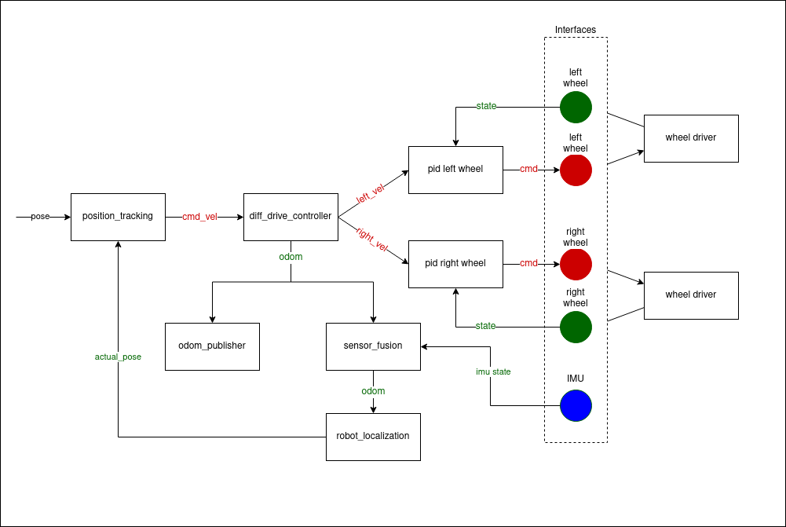

:github_url: https://github.com/ros-controls/ros2_control/blob/{REPOS_FILE_BRANCH}/controller_manager/doc/controller_chaining.rst

.. _controller_chaining:

Controller Chaining / Cascade Control
======================================

This document proposes a minimal-viable-implementation of serial controller chaining as described in `Chaining Controllers design document <https://github.com/ros-controls/roadmap/blob/master/design_drafts/controller_chaining.md>`__.
Cascade control is a specific type of controller chaining.

Scope of the Document and Background Knowledge
-------------------------------------------------------

This approach focuses only on serial chaining of controllers and tries to reuse existing mechanisms for it.
It focuses on `inputs and outputs of a controller <https://github.com/ros-controls/roadmap/blob/master/design_drafts/controller_chaining.md#input--outputs-of-a-controller>`__ and their management in the controller manager.
The concept of `controller groups <https://github.com/ros-controls/roadmap/blob/master/design_drafts/controller_chaining.md#controller-group>`__ will be introduced only for clarity reasons, and its only meaning is that controllers in that group can be updated in arbitrary order.
This doesn't mean that the controller groups as described `in the controller chaining document <https://github.com/ros-controls/roadmap/blob/master/design_drafts/controller_chaining.md#controller-group>`__ will not be introduced and used in the future.
Nevertheless, the author is convinced that this would add only unnecessary complexity at this stage, although in the long term they *could* provide clearer structure and interfaces.

Motivation, Purpose and Use
---------------------------------

To describe the intent of this document, lets focus on the simple yet sufficient example `Example 2 from 'controllers_chaining' design docs  <https://github.com/ros-controls/roadmap/blob/master/design_drafts/controller_chaining.md#example-2>`__:

In this example, we want to chain 'position_tracking' controller with 'diff_drive_controller' and two PID controllers.
Let's now imagine a use-case where we don't only want to run all those controllers as a group, but also flexibly add preceding steps.
This means the following:

  1. When a robot is started, we want to check if motor velocity control is working properly and therefore only PID controllers are activated.
     At this stage we can control the input of PID controller also externally using topics.
     However, these controllers also provide virtual interfaces, so we can chain them.
  2. Then "diff_drive_controller" is activated and attaches itself to the virtual input interfaces of PID controllers.
     PID controllers also get informed that they are working in chained mode and therefore disable their external interface through subscriber.
     Now we check if kinematics of differential robot is running properly.
  3. After that, "position_tracking" can be activated and attached to "diff_drive_controller" that disables its external interfaces.
  4. If any of the controllers is deactivated, also all preceding controllers are deactivated.

Implementation
--------------

A Controller Base-Class: ChainableController
^^^^^^^^^^^^^^^^^^^^^^^^^^^^^^^^^^^^^^^^^^^^^^^^^^^^^^^^

A ``ChainableController`` extends ``ControllerInterface`` class with ``virtual InterfaceConfiguration input_interface_configuration() const = 0`` method.
This method should implement for each controller that **can be preceded** by another controller exporting all the input interfaces.
For simplicity reasons, it is assumed for now that controller's all input interfaces are used.
Therefore, do not try to implement any exclusive combinations of input interfaces, but rather write multiple controllers if you need exclusivity.

The ``ChainableController`` base class implements ``void set_chained_mode(bool activate)`` that sets an internal flag that a controller is used by another controller (in chained mode) and calls ``virtual void on_set_chained_mode(bool activate) = 0`` that implements controller's specific actions when chained modes is activated or deactivated, e.g., deactivating subscribers.

As an example, PID controllers export one virtual interface ``pid_reference`` and stop their subscriber ``<controller_name>/pid_reference`` when used in chained mode.  'diff_drive_controller' controller exports list of virtual interfaces  ``<controller_name>/v_x``, ``<controller_name>/v_y``, and ``<controller_name>/w_z``, and stops subscribers from topics ``<controller_name>/cmd_vel`` and ``<controller_name>/cmd_vel_unstamped``. Its publishers can continue running.

Inner Resource Management
^^^^^^^^^^^^^^^^^^^^^^^^^^^^

After configuring a chainable controller, controller manager calls ``input_interface_configuration`` method and takes ownership over controller's input interfaces.
This is the same process as done by ``ResourceManager`` and hardware interfaces.
Controller manager maintains "claimed" status of interface in a vector (the same as done in ``ResourceManager``).

Activation and Deactivation Chained Controllers
^^^^^^^^^^^^^^^^^^^^^^^^^^^^^^^^^^^^^^^^^^^^^^^^^^^^^^^^

Chained controllers must be activated and deactivated together or in the proper order.
This means you must first activate all following controllers to have the preceding one activated.
For the deactivation there is the inverse rule - all preceding controllers have to be deactivated before the following controller is deactivated.
One can also think of it as an actual chain, you can not add a chain link or break the chain in the middle.

Debugging outputs
----------------------------

Flag ``unavailable`` if the reference interface does not provide much information about anything at the moment. So don't get confused by it. The reason we have it are internal implementation reasons irrelevant for the usage.

Closing remarks
----------------------------

- Maybe addition of the new controller's type ``ChainableController`` is not necessary. It would also be feasible to add an implementation of ``input_interface_configuration()`` method into ``ControllerInterface`` class with default result ``interface_configuration_type::NONE``.
