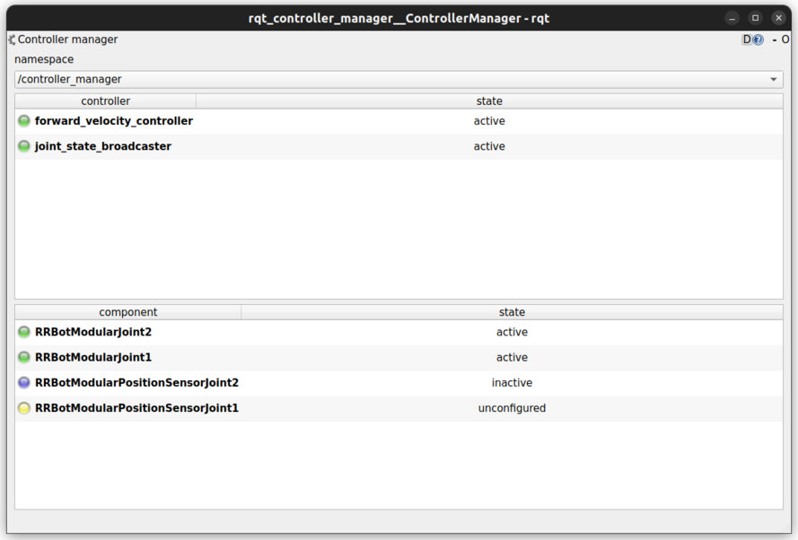
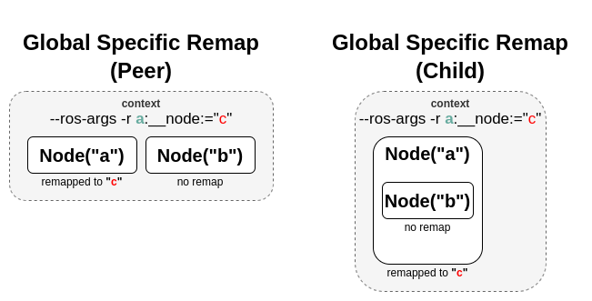

:github_url: https://github.com/ros-controls/ros2_control/blob/{REPOS_FILE_BRANCH}/controller_manager/doc/userdoc.rst

.. _controller_manager_userdoc:

Controller Manager
==================
Controller Manager is the main component in the ros2_control framework.
It manages lifecycle of controllers, access to the hardware interfaces and offers services to the ROS-world.

Determinism
-----------

For best performance when controlling hardware you want the controller manager to have as little jitter as possible in the main control loop.

Independent of the kernel installed, the main thread of Controller Manager attempts to
configure ``SCHED_FIFO`` with a priority of ``50``.
By default, the user does not have permission to set such a high priority.
To give the user such permissions, add a group named realtime and add the user controlling your robot to this group:

.. code-block:: console

    $ sudo addgroup realtime
    $ sudo usermod -a -G realtime $(whoami)

Afterwards, add the following limits to the realtime group in ``/etc/security/limits.conf``:

.. code-block:: console

    @realtime soft rtprio 99
    @realtime soft priority 99
    @realtime soft memlock 102400
    @realtime hard rtprio 99
    @realtime hard priority 99
    @realtime hard memlock 102400

The limits will be applied after you log out and in again.

The normal linux kernel is optimized for computational throughput and therefore is not well suited for hardware control.
Alternatives to the standard kernel include

- `Real-time Ubuntu 22.04 LTS Beta <https://ubuntu.com/blog/real-time-ubuntu-released>`_ on Ubuntu 22.04
- `linux-image-rt-amd64 <https://packages.debian.org/bullseye/linux-image-rt-amd64>`_ on Debian Bullseye
- lowlatency kernel (``sudo apt install linux-lowlatency``) on any ubuntu

Though installing a realtime-kernel will definitely get the best results when it comes to low
jitter, using a lowlatency kernel can improve things a lot with being really easy to install.

Subscribers
-----------

robot_description [std_msgs::msg::String]
  String with the URDF xml, e.g., from ``robot_state_publisher``.
  Reloading of the URDF is not supported yet.
  All joints defined in the ``<ros2_control>``-tag have to be present in the URDF.

Parameters
-----------

hardware_components_initial_state
  Map of parameters for controlled lifecycle management of hardware components.
  The names of the components are defined as attribute of ``<ros2_control>``-tag in ``robot_description``.
  Hardware components found in ``robot_description``, but without explicit state definition will be immediately activated.
  Detailed explanation of each parameter is given below.
  The full structure of the map is given in the following example:

.. code-block:: yaml

    hardware_components_initial_state:
      unconfigured:
        - "arm1"
        - "arm2"
      inactive:
        - "base3"

hardware_components_initial_state.unconfigured (optional; list<string>; default: empty)
  Defines which hardware components will be only loaded immediately when controller manager is started.

hardware_components_initial_state.inactive (optional; list<string>; default: empty)
  Defines which hardware components will be configured immediately when controller manager is started.

update_rate (mandatory; integer)
  The frequency of controller manager's real-time update loop.
  This loop reads states from hardware, updates controller and writes commands to hardware.

<controller_name>.type
  Name of a plugin exported using ``pluginlib`` for a controller.
  This is a class from which controller's instance with name "``controller_name``" is created.

Handling Multiple Controller Managers
^^^^^^^^^^^^^^^^^^^^^^^^^^^^^^^^^^^^^

When dealing with multiple controller managers, you have two options for managing different robot descriptions:

1. **Using Namespaces:** You can place both the ``robot_state_publisher`` and the ``controller_manager`` nodes into the same namespace.

.. code-block:: python

   control_node = Node(
       package="controller_manager",
       executable="ros2_control_node",
       parameters=[robot_controllers],
       output="both",
       namespace="rrbot",
   )
   robot_state_pub_node = Node(
       package="robot_state_publisher",
       executable="robot_state_publisher",
       output="both",
       parameters=[robot_description],
       namespace="rrbot",
   )

2. **Using Remappings:** You can use remappings to handle different robot descriptions. This involves relaying topics using the ``remappings`` tag, allowing you to specify custom topics for each controller manager.

.. code-block:: python

   control_node = Node(
       package="controller_manager",
       executable="ros2_control_node",
       parameters=[robot_controllers],
       output="both",
       remappings=[('robot_description', '/rrbot/robot_description')]
   )
   robot_state_pub_node = Node(
       package="robot_state_publisher",
       executable="robot_state_publisher",
       output="both",
       parameters=[robot_description],
       namespace="rrbot",
   )

Helper scripts
--------------
There are two scripts to interact with controller manager from launch files:

  1. ``spawner`` - loads, configures and start a controller on startup.
  2. ``unspawner`` - stops and unloads a controller.
  3. ``hardware_spawner`` - activates and configures a hardware component.

``spawner``
^^^^^^^^^^^^^^

.. code-block:: console

    $ ros2 run controller_manager spawner -h
    usage: spawner [-h] [-c CONTROLLER_MANAGER] [-p PARAM_FILE] [-n NAMESPACE] [--load-only] [--inactive] [-t CONTROLLER_TYPE] [-u]
                      [--controller-manager-timeout CONTROLLER_MANAGER_TIMEOUT]
                      controller_name

    positional arguments:
      controller_names      List of controllers

    options:
      -h, --help            show this help message and exit
      -c CONTROLLER_MANAGER, --controller-manager CONTROLLER_MANAGER
                            Name of the controller manager ROS node
      -p PARAM_FILE, --param-file PARAM_FILE
                            Controller param file to be loaded into controller node before configure
      -n NAMESPACE, --namespace NAMESPACE
                            DEPRECATED Namespace for the controller_manager and the controller(s)
      --load-only           Only load the controller and leave unconfigured.
      --inactive            Load and configure the controller, however do not activate them
      -u, --unload-on-kill  Wait until this application is interrupted and unload controller
      --controller-manager-timeout CONTROLLER_MANAGER_TIMEOUT
                            Time to wait for the controller manager
      --activate-as-group   Activates all the parsed controllers list together instead of one by one. Useful for activating all chainable controllers altogether
      --fallback_controllers FALLBACK_CONTROLLERS [FALLBACK_CONTROLLERS ...]
                            Fallback controllers list are activated as a fallback strategy when the spawned controllers fail. When the argument is provided, it takes precedence over the fallback_controllers list in the
                            param file

``unspawner``
^^^^^^^^^^^^^^^^

.. code-block:: console

    $ ros2 run controller_manager unspawner -h
    usage: unspawner [-h] [-c CONTROLLER_MANAGER] controller_name

    positional arguments:
      controller_name       Name of the controller

    optional arguments:
      -h, --help            show this help message and exit
      -c CONTROLLER_MANAGER, --controller-manager CONTROLLER_MANAGER
                            Name of the controller manager ROS node

``hardware_spawner``
^^^^^^^^^^^^^^^^^^^^^^

.. code-block:: console

    $ ros2 run controller_manager hardware_spawner -h
    usage: hardware_spawner [-h] [-c CONTROLLER_MANAGER] (--activate | --configure) hardware_component_name

    positional arguments:
      hardware_component_name
                            The name of the hardware component which should be activated.

    options:
      -h, --help            show this help message and exit
      -c CONTROLLER_MANAGER, --controller-manager CONTROLLER_MANAGER
                            Name of the controller manager ROS node
      --activate            Activates the given components. Note: Components are by default configured before activated.
      --configure           Configures the given components.

rqt_controller_manager
----------------------
A GUI tool to interact with the controller manager services to be able to switch the lifecycle states of the controllers as well as the hardware components.

It can be launched independently using the following command or as rqt plugin:

.. code-block:: console

    ros2 run rqt_controller_manager rqt_controller_manager

* Double-click on a controller or hardware component to show the additional info.
* Right-click on a controller or hardware component to show a context menu with options for lifecycle management.

Using the Controller Manager in a Process
-----------------------------------------

The ``ControllerManager`` may also be instantiated in a process as a class, but proper care must be taken when doing so.
The reason for this is because the ``ControllerManager`` class inherits from ``rclcpp::Node``.

If there is more than one Node in the process, global node name remap rules can forcibly change the ``ControllerManager's`` node name as well, leading to duplicate node names.
This occurs whether the Nodes are siblings or exist in a hierarchy.

.. image:: images/global_general_remap.png

The workaround for this is to specify another node name remap rule in the ``NodeOptions`` passed to the ``ControllerManager`` node (causing it to ignore the global rule), or ensure that any remap rules are targeted to specific nodes.

..
  TODO: (methylDragon) Update the proposed solution when https://github.com/ros2/ros2/issues/1377 is resolved

.. code-block:: cpp

    auto options = controller_manager::get_cm_node_options();
      options.arguments({
        "--ros-args",
        "--remap", "_target_node_name:__node:=dst_node_name",
        "--log-level", "info"});

      auto cm = std::make_shared<controller_manager::ControllerManager>(
        executor, "_target_node_name", "some_optional_namespace", options);

Concepts
-----------

Restarting all controllers
^^^^^^^^^^^^^^^^^^^^^^^^^^^^

The simplest way to restart all controllers is by using ``switch_controllers`` services or CLI and adding all controllers to ``start`` and ``stop`` lists.
Note that not all controllers have to be restarted, e.g., broadcasters.

Restarting hardware
^^^^^^^^^^^^^^^^^^^^^

If hardware gets restarted then you should go through its lifecycle again in order to reconfigure and export the interfaces

Hardware and Controller Errors
^^^^^^^^^^^^^^^^^^^^^^^^^^^^^^^

If the hardware during it's ``read`` or ``write`` method returns ``return_type::ERROR``, the controller manager will stop all controllers that are using the hardware's command and state interfaces.
Likewise, if a controller returns ``return_type::ERROR`` from its ``update`` method, the controller manager will deactivate the respective controller. In future, the controller manager will try to start any fallback controllers if available.
