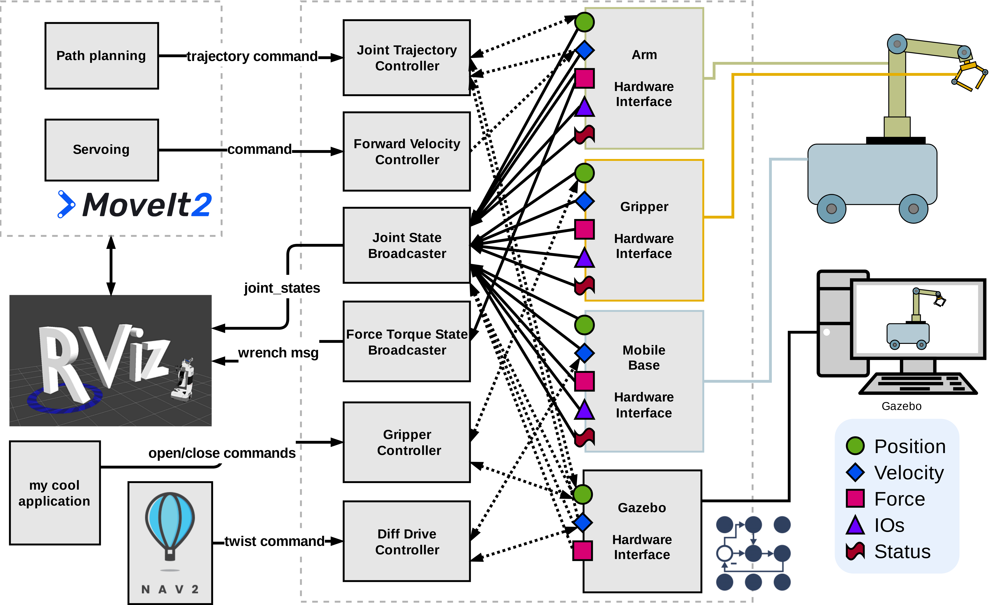
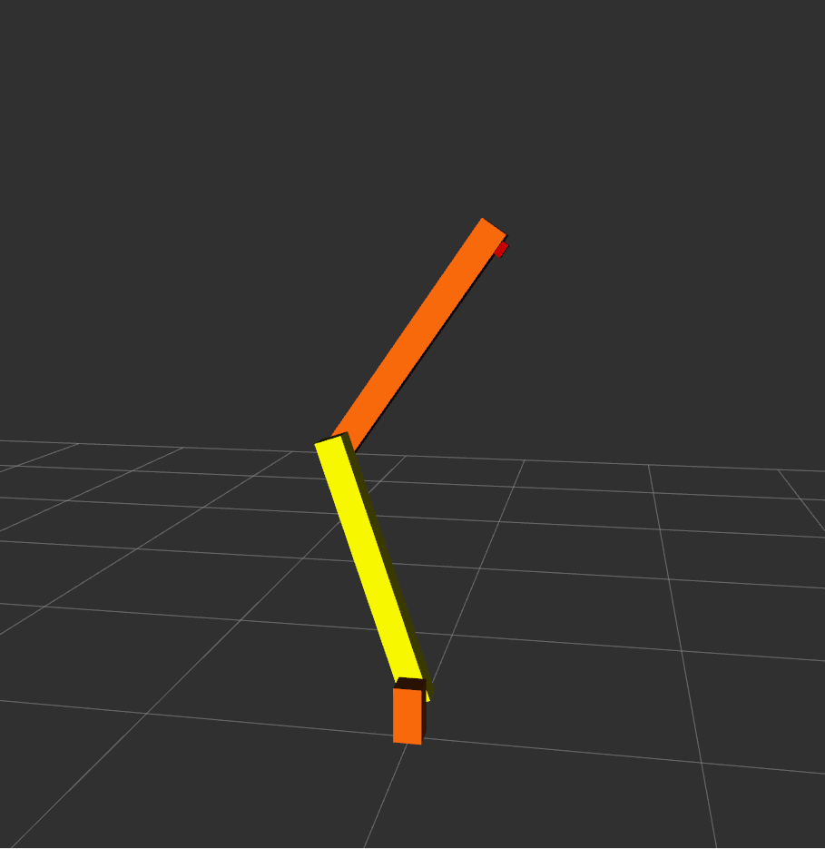
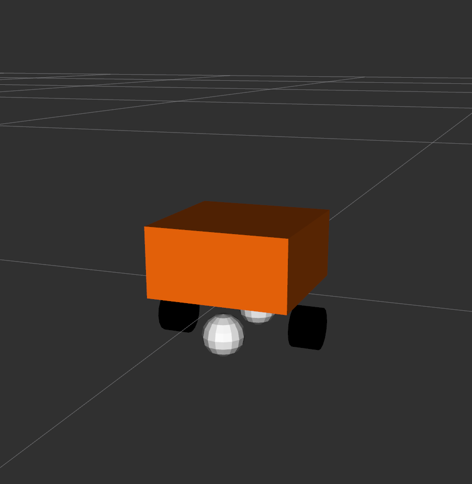
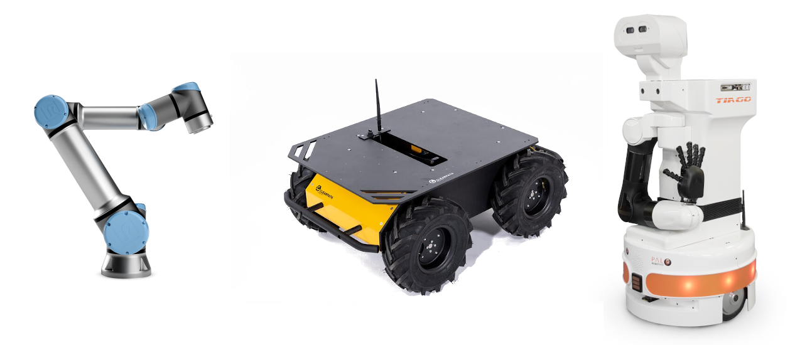

# Abstract
`ros2_control` is a hardware-agnostic control framework focusing on the modular composition of control systems for robots and sharing controllers under the aspects of real-time performance.
Specifically, `ros2_control` provides controller-lifecycle and hardware resource management on top of abstractions of real or virtual hardware interfaces.
Similarly to `ros_control`, `ros2_control` controllers expose standard ROS2 interfaces for out-of-the box 3rd
party solutions to robotics problems like manipulation, path planning and autonomous navigation.
The modular design of `ros2_control` makes it a desirable framework for both research and industrial use.

# Motivation

<!-- history and related work -->

Before the release of Robot Operating System (ROS) [@ref_ros] around 2009, robotic research was very slow because reproducing results was a tedious, long process, especially when it had to be adjusted to a specific robot. The first fully ROS-powered research robot, `PR2` featured a robot-specific control layer to move its mobile base, two arms, torso, and head.
Based on the experiences in the first few years of ROS, [@ref_roscontrol] proposed in 2014 a hardware-agnostic control framework as an evolution to the approach from the `PR2` control system, called `ros_control`. This initiated the era of exchange of control algorithms between research groups, resulting in a set of generic and ready-to-use controllers, mostly for manipulators and mobile robots. Robot manufacturers started shipping their products with `ros_control` implemented on them. The framework took some inspiration from the `OROCOS` [@ref_orocos], a robot control library.

In 2017, work on the industry-grade Robot Operating System, called `ROS2` [@ref_ros2], has begun. A few years later, in 2019, the porting of `ros_control` was ported to `ROS2` also started. This provided an opportunity to redesign and improve some core concepts of `ros_control`, creating a more modern, flexible, and even more modular framework from the ground up, targeting a wider range of use-cases.

% The framework has become one of the main utilities for abstracting hardware and low-level control for 3rd party solutions like the `MoveIt2` and `Nav2` frameworks.

One lesson many roboticists learn is that writing robot hardware drivers is hard. Such drivers are typically done by manufacturers using their own API which may or may not be up-to-date and it is typically the job of the robot user to make a robot ROS-enabled. In order to achieve this, they need to make their own wrapper over a (likely) proprietary API. One of the goals of `ros2_control` is to make it easier for the manufacturers to implement and ship ROS2 drivers with their hardware, making integration with other parts easier.

Another lesson fellow roboticists learn early on is that writing controllers is a non-trivial task.
People well-versed in control theory often write specific controllers for their specific problems, however, this approach does not scale well.
Sharing slightly more general, configurable, and widely tested controllers benefits both the research and industrial communities, allowing them to focus on what is important to them.
\comment{The more a controller is used, the quicker achieves maturity, helping robots be safe and reliable in harsh deployment environments or places where they need to interact with humans.}

# Aim
\label{sec:aim}
<!-- Highlight the research objectives, hypotheses, and/or research questions -->
<!-- # Scope and requirements for a robotics control framework -->
The main goal of the `ros2_control` framework is to provide easy use of common knowledge from control-engineering in robotics applications.

Figure \ref{fig:ros2_control_ach} depicts a conceptual architecture of a control framework for robotics. From left to right, there are custom application-related applications using open-source, 3rd party libraries (marked yellow) for high-level functionalities.
Those applications use a control framework (marked orange) for the abstraction of interaction with hardware and/or physics simulations (hardware abstraction layer (HAL)) to ensure timed and correct communication and error-handling, independently from high-level behaviors.

Based on practical experience with `ros_control`, such an architecture enables roboticists to focus on their **hardware-agnostic** (`RF1`) application while keeping **real-time capabilities** (`RF2`), e.g., shared-memory-based communication between controllers and the HAL, the task of the control framework.
Striving towards that idea resulted in a **set of de-facto standard controllers defining interfaces from 3rd part applications** (`RF3`) towards real or simulated robots.
With a growing number of users, popular simulators, e.g., Gazebo, became **off-the-shelf integration where only a few lines of configuration have to be adjusted** (`RF4`).
Importantly, this ensures that the user does not have to change control settings between simulation and the real robot.

The above requirements were met by the `ros_control` framework.
When designing and implementing a modern control framework, such as `ros2_control`, one should keep in mind complex robotic systems such as industrial robotic cells or mobile manipulators.
For this paper, we use the example of a mobile manipulator depicted in the upper-right corner of Figure \ref{fig:ros2c-mobile-manipulator-control-architecture}.
We consider two aspects of the framework that are generally independent, hardware abstraction and controller management.
This separation in the design is from `ros_control` [@ref_roscontrol] which we intend to keep.

<!-- % TODO: update enumeration to RH1, RH2, ...  - Hardware Requirements
%    * hardware combination
%    * different semantic meaning of the hardware
%    * flexible naming of interfaces
%    * flexible combination of interfaces to controllers, e.g., separate or whole-body control
%    * support for different control modes
%    * lifecycle of hardware - tool changing
-->

Mobile manipulators are usually built from off-the-shelf hardware components, a mobile base, a lightweight robotic arm and a gripper as end-effector. Therefore a modern control framework should support **hardware composition** (`RH1`) so that drivers, i.e., hardware interfaces can be reused for standalone and integrated components. These components also have **different semantic meanings** (`RH2`) which can, in general, be grouped into the following: Sensors (read-only) -- e.g., force-torque sensor in the arm --, Actuators (single joint, self-contained units) -- e.g., parallel grippers and motors --, and general, multi-DoF Systems -- e.g., arms or mobile robots.

Besides the abstraction on the hardware-unit level, it makes sense to abstract dataflow to- and from hardware in the form of interfaces.
For example, interfaces for a mobile manipulator could be wheel velocities, target and actual arm joint positions, and the opening percentage of the gripper.
This implies an arbitrary number of types for a hardware and **flexible naming of interfaces** (`RH3`) with semantic meaning.
The abstraction on the interface level is also useful to achieve an **arbitrary combination of interfaces** (`RH4`) which enables separate control of components or a combination of them when, for example, implementing whole-body control.
The abstraction of hardware dataflow based on interfaces **supports different control modes** (`RH5`).

A control framework should enable hardware components to decide which combination of interfaces is allowed depending on their internal state.
For example, the robotic arm on the mobile manipulator can be controlled using positions or velocities, but not both interfaces at the same time.
On the other hand, another robotic arm can allow setting both interfaces, target position, and average velocity of a joint to that position.
Finally, a control framework should define a **su components** (`RH6`) that supports the temporary inactivation of a component, for example when the mobile base is moving, the arm and the gripper are inactive, i.e., can not be moved.
Furthermore, shutdown and initialization procedures are needed to support tool changing which is very common in industrial robotics.
<!-- % TODO: update enumeration to RC1, RC2, ... Controller Requirements
%    * multi-controller manager
%    * controllers lifecycle
%    * Variable control rate
%    * Asynchronous controllers
%    * value limiters in controllers
%    * controllers chaining
%    * state observers and estimators
-->

<!-- %To control the mobile manipulator depicted in the upper-right corner of Figure \ref{fig:ros2c-mobile-manipulator-control-architecture} built using off-the-shelf components, it would be useful at first to compose multiple controllers that are specifically made for individual hardware, i.e., a robotic control framework should have built-in **management of multiple controllers** (`RC1`). -->
To control the mobile manipulator shown before, it would be useful at first to compose multiple controllers that are specifically made for individual hardware, i.e., a robotic control framework should have built-in **management of multiple controllers** (`RC1`).
Additionally, controllers should have a **lifecycle** (`RC2`) to support online exchange, activation, and deactivation that follows hardware lifecycle and control modes.
In a complex robotic system, hardware components usually have different expectations for writing commands to them, therefore it is sensible to support **individual control rates for controllers** (`RC3`).
To achieve great performance in robotics, optimization methods are often used.
These methods tend to have longer calculations than the control rate of the hardware.
Therefore, **asynchronous controllers** (`RC4`) should be supported by the framework.
Besides a general set of controllers, like, controllers for executing trajectories on robot arms or controllers for differential drive mobile robots, **reusable value limiters** (`RC5`).
Other use cases require more complex, whole-body controllers.
Such controllers often have functionalities from simpler controllers embedded into them, so if such controllers could be **connected as a chain** (`RC6`), individual controllers could have simpler and more focused functionality.
Similarly, modern robotic systems sometimes employ **observers and estimators** (`RS`) to provide data fusion and precise state estimation which rely on the synchronization of data in order to work properly.

From the system perspective, a robot control framework should have concept for **handling errors from hardware** (`RF5`) and **emergency stop events** (`RF6`). In those situations, hardware components can become unavailable and recovery procedures for hardware and deactivation procedures for controllers have to be implemented.

<!-- % TODO: update enumeration to RF1, RF2, ... Framework requirements
%\begin{enumerate}
%    * Hardware Error handler
%    * Emergency stop handler
%\end{enumerate} -->

# Results
\label{sec:results}
<!-- % general overview
% * interfaces
% * controllers concept
% * hw components concept
% * controller manager as the main user interface, resource management
% * lifecycle for hardware and controller components <--- add figure about ROS2 lifecycle state machine
% * ROS2 CLI interface
% * supported simulators & mock hardware components
-->

`ros2_control` consists of three main logical units:

* `Controller and Resource Management` responsible for loading, managing, and connecting hardware and controllers. The main component is called `controller_manager` which is the entry point for management and introspection of the framework's state. This component provides the high-level API for reading states from hardware, updating controller output, and writing commands to the HAL. (Implementing `RF2`, `RH1`, `RH2`, `RH5`, `RH6`,  `RC1`, `RC2`, `RC3`, `RC6`)
* `Hardware abstraction layer` is a set of robot hardware drivers, drivers for simulators, and framework-internal interfaces to them. Those components provide at least one state or command interface that controllers can access, to receive states from or send commands. This architecture abstracts the actual hardware and the simulator from the rest of `ros2_control` and ROS2 system, allowing users to test the same setup in simulation that they would use on the real robot. (Implementing `RF1`, `RH2`, `RH3`, `RH4`)
* `Controllers` are implementations of control algorithms that request access to hardware command and state interfaces. A controller can be simple, e.g., forward commands directly to hardware, or very complex, e.g., generating and interpolating trajectories for the robot or implementing control algorithms, like admittance control. We consider controllers the primary end-user interfaces as well as interfaces for 3rd party applications. A special type of controllers are called `Broadcasters` that only read states and publish them to ROS2 world. (Implementing `RF2`, `RF3`, `RC2`, `RC6`)

Figure \ref{fig:ros2c-mobile-manipulator-control-architecture} depicts a concrete setup of the `ros2_control` framework for the aforementioned mobile manipulator.
\comment{The different symbols in the legend show different hardware interface types, which can be claimed by any controller with a compatible connecting interface type.}
On the left side, 3rd party applications that use `ros2_control` are shown. `MoveIt2` is a framework for collision-free path-planning for robotic manipulators, `RViz2` is the visualization software for ROS2, and `Nav2` is framework for navigation and path-planning for mobile robots.
The 3rd party applications communicate with the official controllers (`RF3`) from `ros2_control` that access interfaces available from the hardware components.

In an example scenario the path-planning component in `MoveIt2` sends  trajectories with constraints to `joint_trajectory_controller` that interpolates positions for specific hardware to produce smooth motion.
On the other hand, if the servo component is used the commands are sent to `forward_velocity_controller` to write those directly into the HAL.
The `joint_trajectory_controller` and `forward_velocity_controller` need access to the different combinations of interfaces (`RH4`), position commands, and position and velocity states in the first case, and velocity states and command in the second case.
This is managed by `controller_manager` (`RC1`) that dictates the controllers' lifecycle\footnote{`ros2_control` is using standard ROS2 lifecycle state-machine from [@ros2_lifecycle] (`RC2`) based on their configuration and requirements and ensures exclusive access to interfaces from the common pool.
Additionally, hardware is set into different control modes (`RH5`) depending on requested interface access from controllers.

In the left lower corner of the figure, a map-based global and sensor-based local planner from `Nav2` send Cartesian velocities to `diff_drive_controller` that calculates inverse kinematics for given parameters of differential kinematics and writes wheel velocity values into hardware interface of mobile base or a simulation (`RF4`).
In general, 3rd party applications will never know if the commands are executed by a hardware or simulation (`RF1`).
Accessing the mobile-base interfaces is independent of the access to the arm, thanks to the HAL, implementing hardware composition (`RH1`).
Finally, an imaginary high-level component, `my cool application` monitors sensor data and the robot's surroundings to determine when to trigger `gripper_action_controller` to open or close the end-effector of the robot arm of type "Actuator" (`RH2`) since those usually have only one degree of freedom.

Meanwhile, the standard ROS2 visualization software, `RViz`, uses the data from `joint_state_broadcaster` to visualize the robot arm, given position feedback from the robot as well as the forces affecting the end-effector of the robot, made available by the `force_torque_state_broadcaster`.
Broadcasters are the special type of controllers that read data from HAL and need access to state interfaces only.
Besides standard, "position", "velocity", and "effort", interfaces, `joint_state_broadcaster` publishes all available states from the system independently of their name providing flexibility and semantic consistence (`RH3`).

\comment{The section of `MoveIt2`, in upper-left corner, contain robot arm path planning elements connecting to the `joint_trajectory_controller` of `ros2_control`, producing smooth motion, avoiding obstacles with the robot arm. When active, the servoing component is sending references to a `forward_position_controller`, allowing a more manual way of control for fine tasks. The other block of high-level input components on the lower side of the figure are e.g. a map-based global and sensor-based local planner from  `Nav2`, sending standard ROS messages to an instance of the `diff_drive_controller`, driving the mobile base of the robot. Finally, an imaginary high-level component, `my cool application` monitor sensor data and the robot's surroundings to determine when to trigger the gripper controller to open or close the end-effector of the robot arm.
The blocks in the rightmost column show the different hardware components exposing their interfaces when using the real robot and the equivalent (shown in the same figure for brevity) Gazebo component, creating the same interfaces when using a simulated robot.
It is the job of the `controller_manager` to ensure that controllers have exclusive access to these resources, as well as only controllers that have their requirements met are allowed to start to operate. When a controller is deactivated, it returns the claimed interfaces to the common pool.}

Besides the need to port `ros_control` to ROS2, the redesign of the library solved a number of former drawbacks.

* Fixed set of interface types between hardware and controllers limited to position, velocity, and effort types. `ros2_control` natively supports custom interface types, using a simple string to identify them. Any number of user-defined interfaces can be handled by the framework.
* Rigid representation and semantics of robot hardware using only one base class. `ros2_control` explicitly supports  multiple semantic representations of standard components in robotics systems. These can be grouped into the following: Sensors (read-only interfaces), Actuators (single joint, self-contained units), and multi-DoF Systems (read/write interfaces, fully customizable).
* Unclear semantics of controllers, e.g., controllers that don't actually control anything but only read data and deliver it to ROS. `ros2_control` introduced a separation between `Controllers` reading state feedback interfaces and commanding hardware interfaces from `Broadcasters` that only read hardware state.
* Limited possibility of hardware composition that always included changes in code. Hardware composition is a first-class citizen in `ros2_control`. Every hardware component is a plugin, loaded and configured dynamically.
* Only one control rate for controllers. `ros2_control` added support for variable control rates for controllers.
* No framework support for online hardware exchange or different bring up times. By taking advantage of standard ROS2 lifecycle [@ros2_lifecycle] facilities and supporting dynamic loading of hardware components, `ros2_control` is able to ensure that declared startup dependencies are respected.
* High code complexity due to use of multiple layers of templates and inheritance. `ros2_control` is not a port of `ros_control` but a rewrite with leaner code, utilizing modern C++ features.

<!-- % \begin{figure}
%     \centering
%     \includegraphics[width=0.5\textwidth]{ROS2nodelifecycle_smaller.png}
%     \caption{ROS2 lifecycle graph used by `ros2_control` system components and controllers TODO: re-draw this in a more compact / paper friendly form}
%     \label{fig:lifecycle_graph}
% \end{figure} -->

<!-- % using different control modes -->

<!-- % ros2_control also provides several libraries to support developing new controllers. -->

# Documentation and examples

<!-- % * demos repo -> reference systems: rrbot, diffbot, design drafts
% * docs page -->

## Demos

The `ros2_control_demos` repository [@ros2_control_demos] implements several reference systems, configuration and launch files.
This repository serves as a collection of good examples for uses of the framework and especially for people implementing `ros2_control` support for their robots. To help this process, we created a list of common robot control use-cases and hardware architectures and captured it in a document in the roadmap repository [@ros2_control_roadmap].
The two virtual robots depicted in Figure \ref{fig:demo_robots} are often used for integration tests or manual testing. `RRbot` is a 2 DoF robotic arm while `Diffbot` is a simplified, differential-drive mobile robot.

 { width=45% }
 { width=45% }

The demos repository is kept as a source-based, rolling setup that does not get releases to any ROS distribution but should always work with the latest version of `ros2_control`.

## Documentation & Availability

The first alpha release of `ros2_control` was added to ROS2 Dashing in 2019 and similarly beta, source-based support for ROS2 Eloquent the same year. Starting from 2020, `ros2_control` was part of the regular ROS2 release, which to this day include the Foxy, Galactic and Humble distributions. Following the introduction of the special distribution, Rolling, to ease ROS2 releases, new functionality is released and made available on a weekly basis.

The documentation portal [@ros2_control_documentation] supports all ROS releases of `ros2_control` starting from ROS2 Foxy. The contents of the portal are compiled daily from locally available material and the distribution-specific branches of the `ros2_control` Github repositories where some package-specific documentation lives right next to the code for ease of update and maintainability.

## Impact

With `ros2_control`'s support for component-based hardware drivers, companies and research groups have already started implementing drivers for different robots. Figure \ref{fig:supported-robots-example} shows a few examples, namely the `UR16` robot arm by Universal Robots, the mobile-robot `Husky` UGV by Clearpath Robotics and finally the `TIAGo` mobile manipulator by PAL Robotics.

These robots all have slightly unique aspects to them, for example, but not limited to, `UR16` uses some non-joint interfaces to adjust settings and uses it's own internal board to run a control loop, `Husky` integrates an `Inertial Measurement Unit` into the mobile base while `TIAGo` runs `ros2_control` natively with a realtime Linux kernel as well as reporting joint and force-torque sensor data.

The above list of robots is merely a demonstration. Companies and community members are welcome to share their `ros2_control`-compatible robots on the `Supported Robots` page on [@ros2_control_documentation].

# Conclusion and future work

The `ros2_control` framework is already widely used in ROS2 community. The most relevant library for mobile robotics `Nav2` and for manipulation `MoveIt2` are fully relying on hardware abstraction and execution of control algorithms from `ros2_control`.

For example, a stereotypical mobile robot that is made up of a mobile base and an arm can be integrated with ROS2 simply by providing `ros2_control` drivers for the base and the arm, no problem if they are from different manufacturers.

A few configuration files is all one needs to get ready to navigate autonomously and do path planning for the arm.

Some of the requirements presented in Section \ref{sec:aim} were not referenced in Section \ref{sec:results}. These are **handling errors from hardware** (`RF5`), **emergency stop events** (`RF6`), **reusable value limiters** (`RC5`) and **asynchronous controllers** (`RC4`). All of these requirements are either on our roadmap for 2022 or planned for 2023.

# Acknowledgements

The authors would like to express their gratitude to the following organizations for their continued support:
PAL Robotics, PickNik Robotics, Stogl Robotics, and Bosch.
